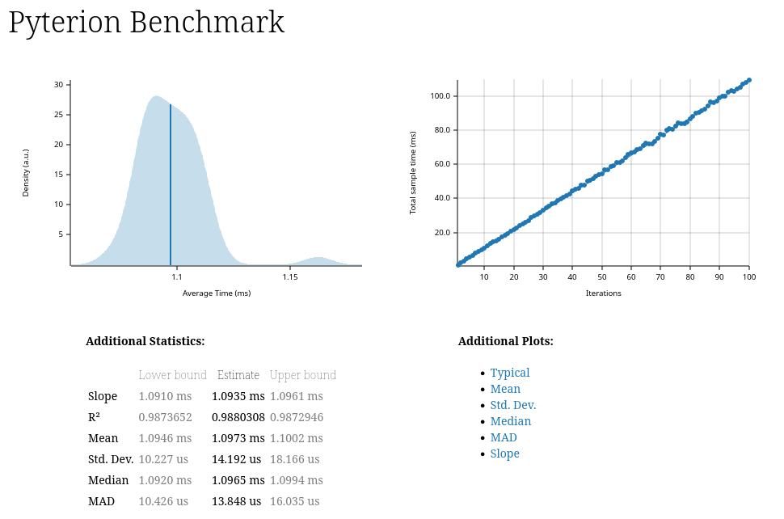
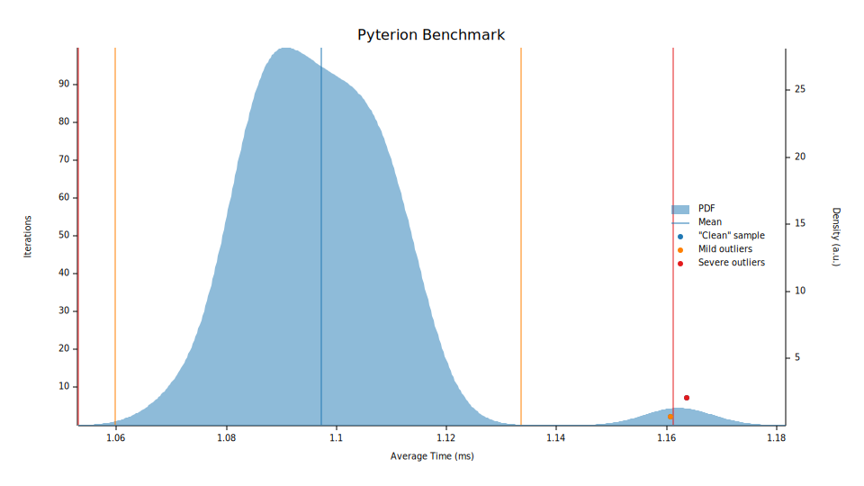

<h1 align="center">Pyterion</h1>
<div align="center">Statistics-driven Microbenchmarking in Python</div>

<div align="center">
<a href="https://github.com/dignissimus/pyterion"></a>
<a href="https://github.com/psf/black/blob/main/LICENSE"></a>
<a href="https://github.com/psf/black"></a>
</div>

-----

Pyterion is a Python library that provides utilities to benchmark and analyse performance.

------

# Example
To benchmark a function, you can use the `benchmark` decorator.

```python
import time
from pyterion import benchmark

@benchmark
def function():
    time.sleep(0.001)
```
Or alternatively
```python
import time
from pyterion import benchmark

def function():
    time.sleep(0.001)

benchmark(function)
```

The above code below will produce the following output among other statistics and visualisations.




# Related projects
* [criterion.rs](https://github.com/bheisler/criterion.rs) - The Rust microbenchmarking library that pyterion is based on
* [criterion](http://www.serpentine.com/criterion/) - The Haskell microbenchmarking library that inspired criterion.rs
